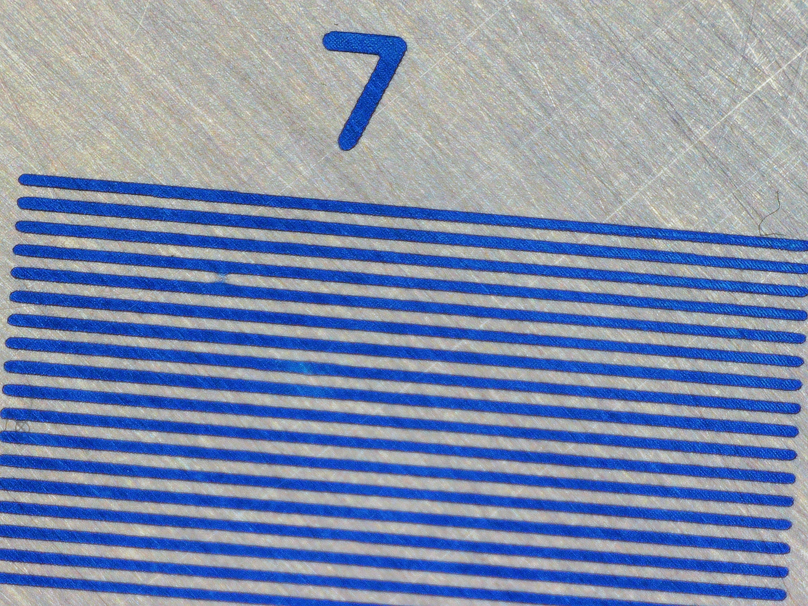
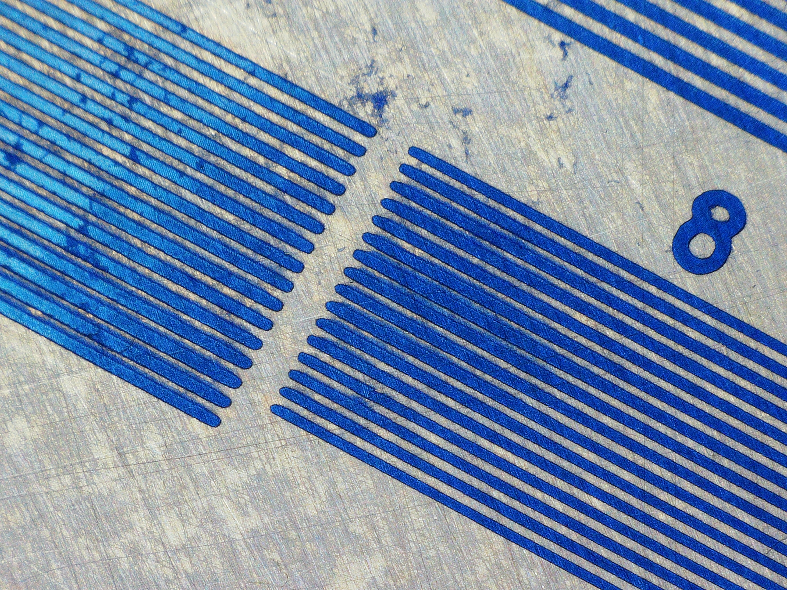
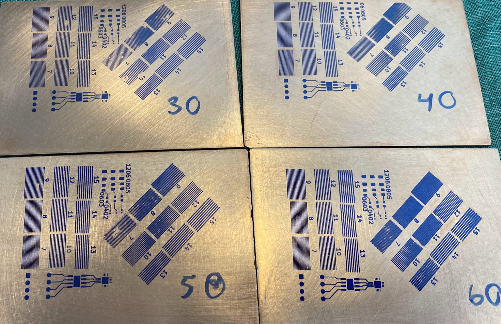
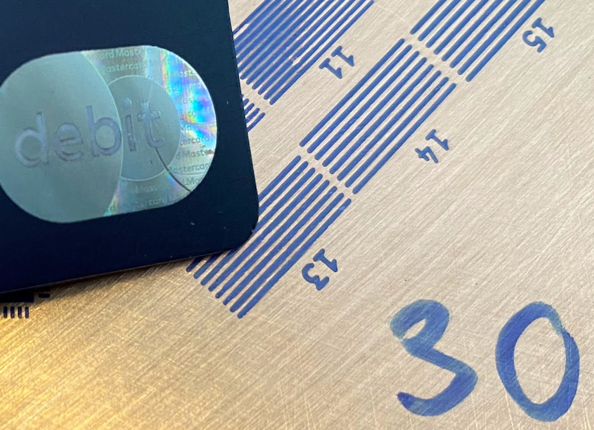
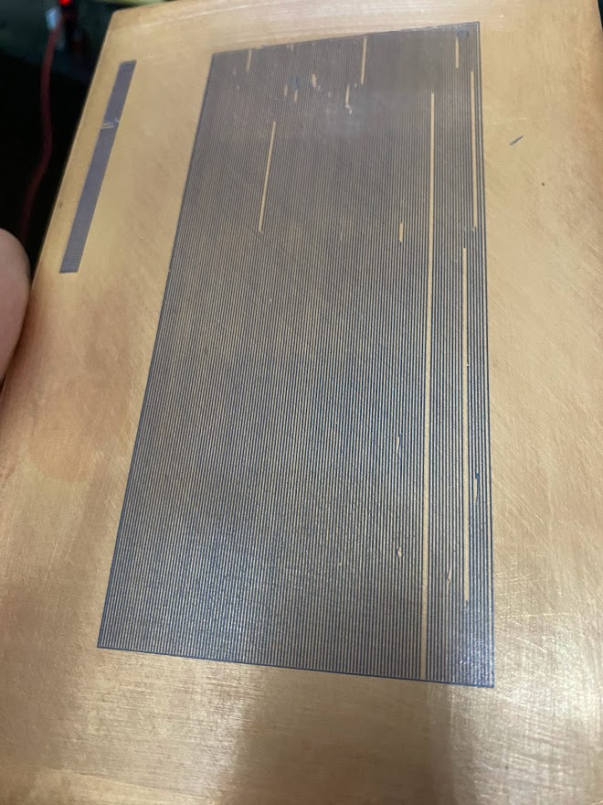
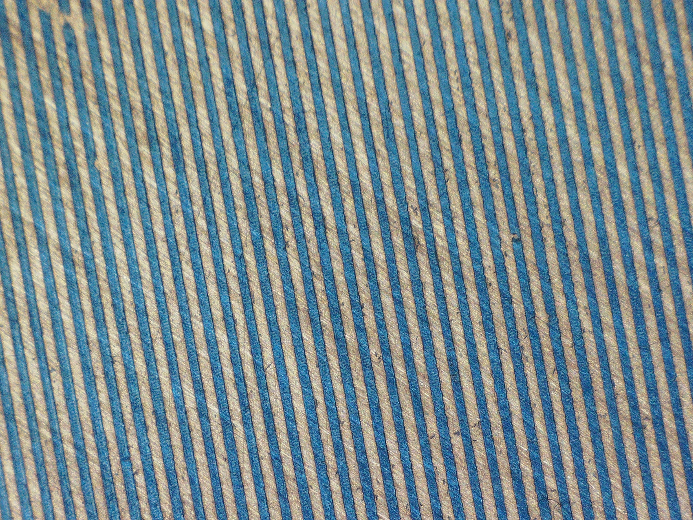

# DIY PCB with a resin 3D printer

I have an Anycubic Photon M3 printer, and saw [Thomas Sanladerer's video ](C:\Users\caleb\diy-pcb) on making PCBs with his resin printer, so I wanted to give that a go.  Here are my results.

I found a great tips and trics document, but I don't really know who made it or what the license is.  But I'm copying it into markdown format here for convenience.

* [Tips And Tricks](TIPS.md).  You can always grab the original [PDF](https://sparks.gogo.co.nz/dry-film-tips.pdf) here.

## Test PCBs
I made a test for testing how well the photo transfer works.  Turns out, if all is working perfectly, I can get well defined trace and space down to 7mil.

Unfornately, not everything is perfect all the time:

So the details matter.

This test PCB design is under (test_pcb/test_pcb).

## Convert the gerber -> STL
In order to get the gerbers into STLs, I used [Flatcam](http://flatcam.org/) to go from Gerber->SVG, and then [OpenSCAD](https://openscad.org/) to go from SVG->STL.

Go to the [Gerber2STL](gerber2stl.crome.org) web site and drop a gerber there.

## Apply the photoresist
The photoresist I used is a positive resist (I think...)  Wherever it's exposed, it hardens and stays in place, which meanns white==copper.  This is the exact photoseisitive dry film I used https://www.amazon.com/dp/B07MMVPY1Z?psc=1&ref=ppx_yo2ov_dt_b_product_details.  It seems to work great.

It's definitely tricky to get perfection on applying the film.  I'm still working to get good at that.

## Exposure
Exposure is pretty simple.  Once you have your STL, open it in Chitubox and set the first layer exposure to your exposure time.  

You can see 4 exposures of 30, 40, 50 and 60 seconds. The 30 second exposure is plenty -- I used a credit card to try to scrape off the photoresist, and I couldn't do it.  I need to do another batch of exposures to see where it stops working.

The vertical tracks look great (except where you can see I didn't get the photoresist adhered to the PCB).  However, there is a blobby area on all 4 exposures on the diagonal traces, at the 8 mil area.  I believe this is due to the un-even illumination of the print-bed.  

To test that hypothesis, I made a 10/10 test PCB that covers the entire print bed. It actually came out quite nicely, ecept where I ripped the tracks off the PCB right after developing the mask.  The material is soft at 30 second exposure.  Probably want to bump that up a bit maybe to 45 or so.

