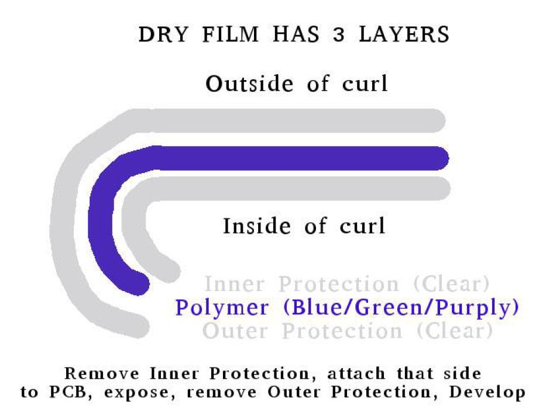
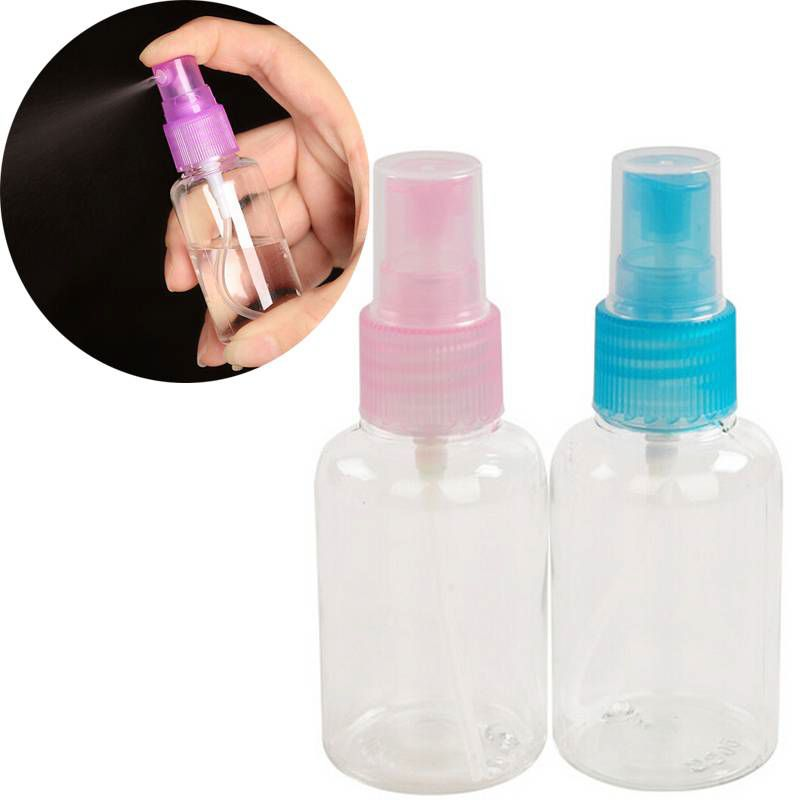
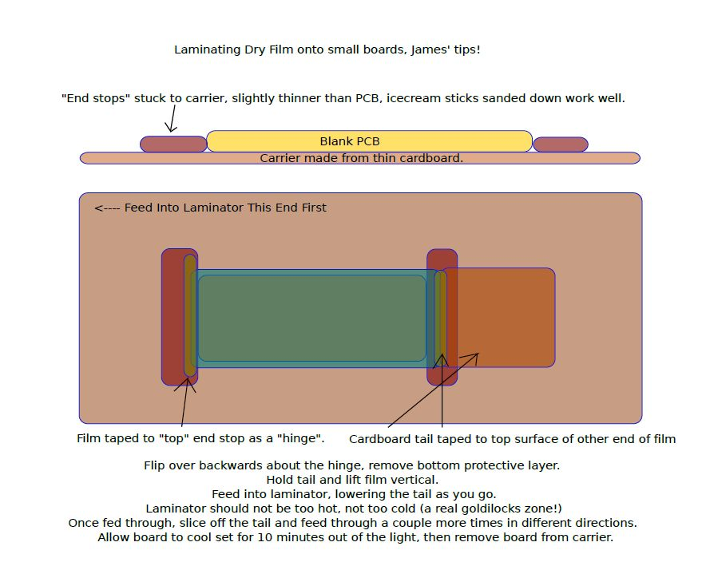
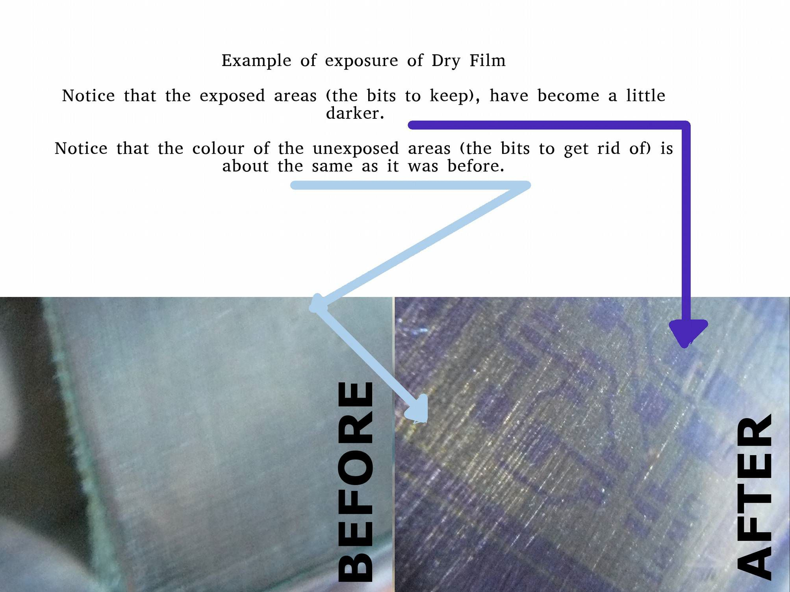
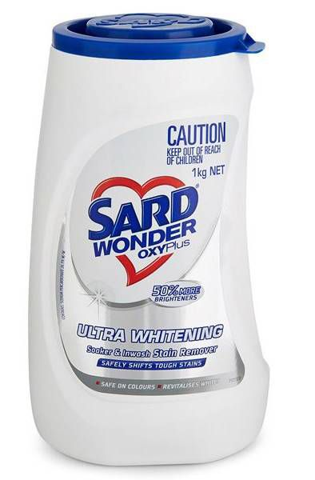
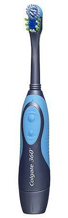
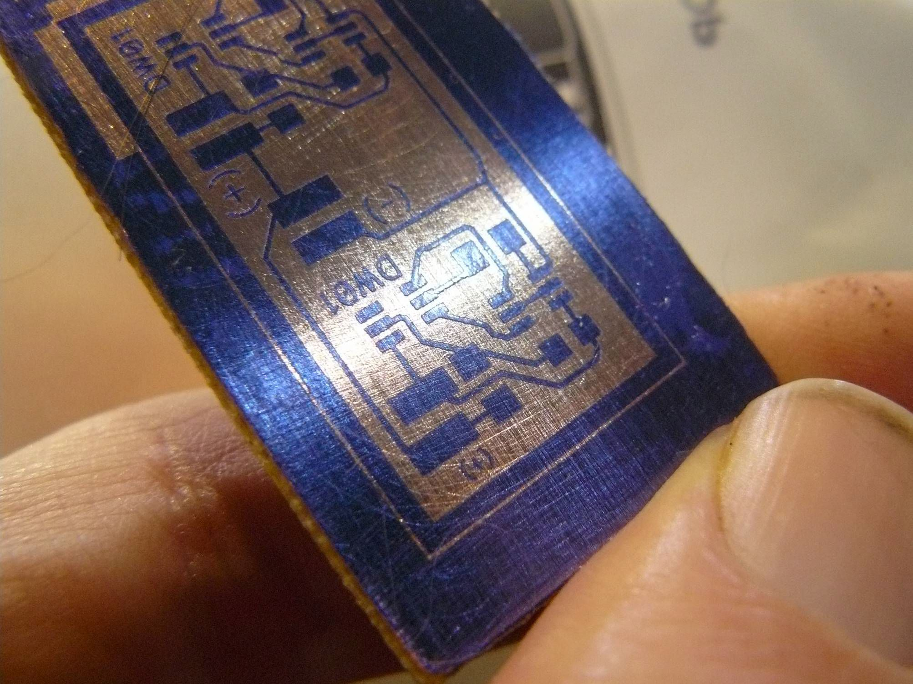
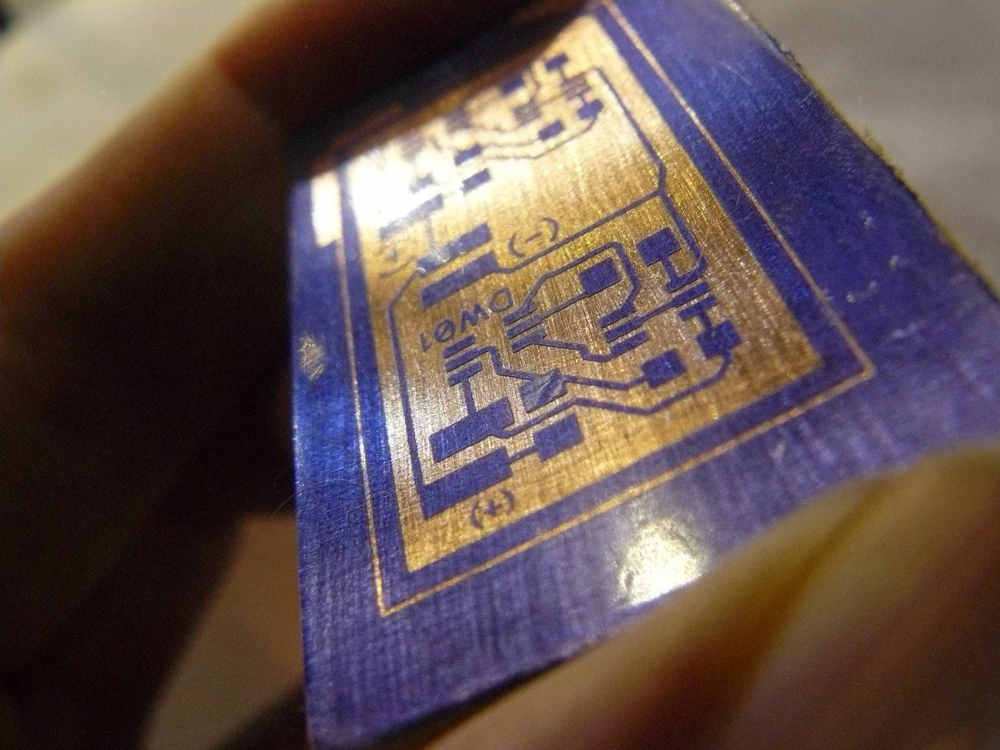

*note: this is not my work.  I got it from here https://sparks.gogo.co.nz/dry-film-tips.pdf.  Copied here for markdown convenience*

# Dry Film Tips
**Updated October 2017**

## Hints and Tips For Use

First a couple of notes

**What is Dry Film.** Dry Film is a photo-resist, when
strong UV light hits it, where the light hits, it
hardens and this hardened form resists etching
solutions. The film is comprised of three parts, the
blue layer is in the middle, this is the polymer which
hardens with UV, on each side of this polymer is a
protective transparent film.

**How do you use it?** In very brief summary, one
protective layer (the inside of curl generally) is
removed, the now uncovered polymer side is attached to
the PCB, the PCB is exposed to UV through a 'mask'
which has transparent traces to allow UV to harden the
traces image , the remaining protective “ ” layer is
removed and the PCB is developed in a solution of
washing soda (Sodium Carbonate), then the PCB is
etched.

The rest of this document gives you all the steps, tips
and tricks which I have learned in using Dry Film! Be
sure to read it, save yourself lots of experimenting!

**Practice, Practice, Practice.** I advise cutting some
small squares of film a couple of cm squared and using
these to get the hang of affixing it to a board and
developing, use some moderately dense small (section
of) artwork with the finest traces you want to do, with the narrowest spaces you want to do etc. You might want to practice 5 or 10 times before doing it for
real. If you mess one up, just clean it off, and start again.

**Units.** If you are new to designing circuits you might not know about the unit called “mils”. Here in New Zealand (and other civilised countries who use the metric system) when a somebody says “oh it's about 50 mils they usually mean 50 millimeters ” “ ”. But when
dealing with electronics “mil” means “one one-thousandth of an inch” and it is used a lot even by normally sensible metric people.

So when I write for example “10 mils”, I mean 0.254
millimeters (one quarter of one millimeter), or 254
microns if you prefer. 8 mils is about 0.20mm, and 12 mils is about 0.30mm.

About 10 mils is achievable for a trace width (maybe
even 8), and 10 mils keepout (between traces), but for practical purposes 12 mils or greater for both makes your life a lot easier :-)

## Cleaning the PCB
To begin with you must clean your blank PCB surface
thoroughly.

Most recently, this is my way...

Grab some 150 or finer (higher number) sand paper in a pack from the local cheap-chinese-shop, I would not go less than 150, but 150 is fine (it's what I'm using currently, 150 dry tan coloured sand paper).

Sand the PCB, I sand in 4 directions, vertically, then horizontally, then on an angle one way, and on an angle another way.

Wipe the PCB with a paper towel wet with acetone.

I find that this works just fine, no messing about just good old abrasion.

## Attaching The Film
A good attachment without bubbles and wrinkles is the key to success.

The film needs moderate heat and pressure to properly adhere enough to resist.

Presented in this document are two (three) methods, one using a Clothes Iron (or Hot Air, or even a Hair Dryer) and one using a Laminator.

### Wet Lamination Method (Clothes Iron, or Hot Air)
This method is my current favourite, it is sort of my own devising and works quite well at least for the small (7x10cm or less) boards I most commonly make.

In addition to the dry film you will need a “travel spray bottle” of water, you can buy such bottles at your local cheap-chinesestuff store, and some
sellotape.

Start by cleaning your PCB as detailed
previously.

Now with the PCB clean and dry place it on a flat surface (that's not going to care if it gets hot, your mum's dining table probably not a good place).

Set your iron to a cool setting, 60-70 degrees works
for me, usually just a couple clicks off the lowest
possible setting. Clothes irons are not that accurate at temperature regulation, give it a few minutes to settle before you check the temperature (if you have a temperature probe).

Take your travel bottle of (room temperature) water and give a couple pumps to put a light mist onto the PCB, you don't need to drench it, just a light spray. It doesn't matter if it's not totally even coverage.

Now take your piece of film (about 1cm larger than
required for easier handling). Stick a piece of
sellotape on each side of the film at one corner, pull the two pieces apart, the bottom (inside of curl) layer should pull away (this side goes against the board).

Now drape the film onto the misted pcb, and take a
small wad of paper towel and use that to smooth the
film down from the center to the edges pushing out the water and air, check for bubbles and dust, you can usually peel the film up a bit and get rid of them at this stage.

Once you have the film smoothed down onto the pcb, take your clothes iron and literally iron the film onto the pcb. You don't need to press it through to the other side of the planet, it's really the heat you want, and mild pressure, this is what causes the adhesion.

If you don't have a clothes iron, you can also use hot air from your reflow station, and I have heard also of using a hair dryer but not tried that myself, just heat and rub the film down on to the pcb.

Pay special attention to the edges of the board, these are the problem areas, roll the iron over the edges.

If you have a little wrinkle, bubble, tear, in the
polymer (photo) layer, try using the tip of the iron to “buff” it out, the polymer is soft at this 60-80 degree temperature and can be “smooshed around” with the iron tip to smooth small problems out.

After perhaps 60 seconds of ironing things should be
nice and toasty, not so hot you can't hold your hand
onto the PCB, but hot enough that it's not comfortable to do so :-)

A note on temperature; if you go too hot, you will get quite obvious ugly blisters under your film, this is no good those blisters will just wash off when you develop, clean it off (or cut/scrape/clean those areas and re-laminate a patch if you want to try that, sometimes you can get away with it :)), reduce your iron temperature and start again with a fresh piece.

If you go too cold, the film will also not attach well during development and etching.

**Caution:** clothes iron temperature regulation may be quite poor - your fancy pantaloons probably don't care if they were ironed at 80 degrees or 110 degrees so clothes irons are pretty simplistic at controlling their temperature. If you have a temperature probe for your multimeter use it to get a feel for where to set your iron's dial and note which parts of the baseplate are hotter/cooler, aim for 60 to 75 degrees at the hottest point.

For Double Sided Boards you must allow the board to
cool down to room temperature again before you try
and attach the second side. You should allow the board to cool to room temperature before you expose.
If you find that the photo layer isn't stuck to the pcb totally (try peeling the top protection layer up a little on a corner) and you are sure your cleaning was well done then you know that you needed to warm it up more, or more evenly (spread the iron around), or a fraction more pressure, the most likely places to have a problem are the edges. Before exposure you can always try to iron it down a bit more to try and get that to stick.

**Now, continue to Exposure!**

### Laminator Method
If you have a laminator, then using this can produce a good result, but you will want to do some preparation first.

Clean your blank PCB as previous.

Place PCB on a carrier and attach a piece film cut to about 5mm larger on each side than you need to the top end-stop, with tail attached to film (see next page for diagrams of my carrier setup).

It is better to cut 5mm larger on each side than you
need, but if you do use right up to the cut edge of a piece of film have a careful look at the edge,
sometimes there is a visible “border” of lighter
colouring (more transparent) running down an edge (as it comes off the roll), if visibly different this border should be avoided as it's performance may be degraded a bit.

**Note** – film has top and bottom (PCB) side, the bottom is the inside of the curl and that goes against the PCB. If your film was sent flat, the cardboard wrapping is marked with which is top and which is bottom.

The film has a protective layer on both sides with the soft resist material in the middle. Flip film over and remove the bottom side layer – easy way, stick a piece of sellotape on each side of a corner of the film, pull the two bits of tape apart, the bottom layer will peel off (actually, it's really not a big deal if the top layer comes off instead, seems to work either way up, but inside-of-curl-down is “the norm”).

Hold film vertical by the tail and feed into laminator, lowering the tail as you go, this eliminates air bubbles.

Cut off the tail. You may then want to run it through the laminator a couple more times.

If you did get a bubble in there, prick it with the tip of a craft knife and run it through the laminator, or buff it with the tip of a cool clothes iron.

Allow to cool, then remove PCB. Laminated boards can be stored in the dark ready to use, not sure how long for, I've stored them for 2 weeks before using without any trouble, so perhaps forever is the answer.

## Exposure:
You need a negative artwork, transparent areas will remain on the board as resist, black areas will be removed.

You can of course produce the artwork however you like, but if your system is capable to use it you might like to see this script that converts Gerber files produced by common PCB design packages into to PDF artwork https://github.com/sleemanj/gerb2etch

I recommend a good 2mm border on your artwork - that is, no traces closer than 2mm to the PCB edge, the reason is that the most likely place for the resist to lift or get a poor exposure is at the edges.

**Top tip:** The resolution you can get is very high, even with our rough-and-ready setup, exposing to the sun using tracing paper. However, if you put traces very close together (about 8 “mil”, 0.21mm or less) any “UV bleed”, overexposure... can lead to traces in the resist which are touching. This is easily fixed before etching but to save you the trouble, remember that thin traces are easy, but close traces are hard.

I'd suggest sticking with a “keepout” of around 0.254mm (10 mil) at the minimum, and your traces could go down to 8 mil – that said, for repeatability, I don't recommend trying to get below 12 mil, sure you CAN do 8 mil, but they are so tiny that it is very very easy to damage them, and there just isn't easily fixable with a pen at that sort of size.

Personally, I try to stay at 13 mil or thicker traces, with 12 mil or wider keepout unless there is just no other way, it makes for much less fiddling about if you can stay above 10 mil.

Tracing paper is a good medium for printing your
artwork on, you don't need to use transparencies. You
can either use a single copy or print two copies, and
stick them together to increase the darkness of the
black areas.

Using a single copy may require a quite short exposure
depending on your printer's toner density (1 minute 20-
30 seconds for me using UV leds), and any imperfections
in the artwork will need to be touched up with a pen
first, using two copies will mean that the exposure is
longer (2 or even 3 times as long), but the
imperfections in your printer's tonor is less of a
problem. Personally, I use a single copy, but,
experiment with your own!

Can you use an inkjet? Some people do and find it
works, some people tried and found it doesn't, so short
answer is, maybe depends – on your ink!

It may be useful to put a strip of packing tape (or
perhaps contact book covering) over each print to
protect the toner - depending on your printer, toner
may rub-off tracing paper easily, tape protects it
while you are aligning your two copies, and doesn't
affect the exposure much. But for very fine detail,
avoid this if possible.

Apply the artwork, tonor-side-to-board, make sure it is
tightly against the board (a piece of glass on both
sides to make a sandwich and a couple of quick-clamps
or even bulldog clips to hold it together is one way,
put something on the back of the PCB in the sandwich to
ensure that the board is pressed FIRMLY to the artwork)
and expose to Ultraviolet light (eg, the Sun).

**Time of exposure varies.** Experiment to find your sweet
spot. To give an idea, about 10 minutes in full Sun
produces a strong exposure, possibly a bit too long.
Under UV LEDs about 2 to 5 minutes for a double-copy
tracing paper, about 1-2 minutes for a single-copy with
an array of 5mm leds, and for my current box with 4
1Watt UV leds it's a super fast 22 seconds.

You don't need to be too precise with double-copy,
there's plenty of wiggle-room if your artwork is dark
enough, it's quite hard to go wrong! With single-copy
it's a bit more exacting.

**Protip:** if you want to tune-in your exposure times,
try my PCB test pattern artwork and procedure available
here https://github.com/sleemanj/pcb-test-pattern

Once exposure is complete remove the artwork and you
will CLEARLY see the traces burned “ ” onto the board.
Leave the board to further cure in a dark place for a
few minutes.

**NB: Exact colour of pre-exposed film varies between
manufacturers and types, but for the most part they
work the same, exposure time might vary slightly.**

## Developing:
Carefully remove the top protective layer from the
film, if your lamination technique and cleaning was
good you won't pull up any of the traces, if it wasn't,
you will.

Place board in a developing solution, the solution is
Washing Soda (Sodium Carbonate, also often as Sodium
Percarbonate, Sodium Peroxyhydrate, they will all
work), which you can purchase at the supermarket.

It is used in a very wide variety of
products especially in the laundry,
look for powdered forms.

For example Sard “ Wonder Oxy Plus” in
any laundry aisle works well, as
should any other similar powdered
laundry stuff with Sodium
Carbonate/Percarbonate/Peroxyhydrate.

You can also buy pure Sodium Carbonate
in the laundry aisle of most
supermarkets, look for natural fabric
softeners!

Mix about 30g of the sodium carbonate
containing laundry powder of your choice into 1 Litre
of water. Doesn't need to be precise. Mix it up real
good, I put it in a pepsi bottle and give it a good old
shake.

30g/L at room temperature works for me.

Let the board develop for a couple minutes (watch it
though), swoosh the liquid over it. The unexposed
areas will dissolve leaving the traces in place. You
can lightly massage the board with your fingers to help
the process along.

Using a vibrating type toothbrush very
gently can really help developing.
Don't scrub, just “wipe” really, the
traces are strong enough to resist the
brush, but not totally hard yet so you
can damage them. Obviously, don't use
your actual toothbrush, maybe now is a
good time to buy a new one and relegate
your old one to PCB duty.

It's done when it looks like all the
left over gunk has gone and you have
nice clean traces, look at the pads and
holes, look to see if there is any gunk
still sticking between close together
traces.

Rinse the board under running water to
get rid of all the developing solution.
Then dry it by patting with a paper
towel.
Eye protection is perhaps a good idea,
washing soda in your eyes could be a
bit unpleasant, but apart from that
it's not dangerous.

*After developing (2-3 minutes) and rinsing the copper to be removed is clean and all "gunk" removed.*

## Hardening Exposure:
After developing to put the developed board in full UV
(no artwork/mask necessary) for a longer exposure, this
will harden up the developed traces “ ” completely. I use
a hardening exposure twice as long as the original
exposure.

After the hardening exposure, you may notice a slight
blue tinge on the bare copper areas which indicates
some resist residue, you can easily remove this with a
few seconds in the developer and a rub with your
fingers or a toothbrush, then immediately rinse in
water again.

*After the hardening exposure, little change is apparent just a bit darker. Notice there is no bluing of the copper to be removed indicating the developing was long enough and not overexposed. If there was bluing,it can go back in the developer briefly to clean it up then rinse.*

## Drying:
The developed traces will feel a bit tacky. It's a
good idea now to either let the board air-dry, or use a
hair dryer or hot air rework station to dry the board
until it's not tacky any more.

If you try and touch-up a tacky board, you're going to
have a bad time.

*Reader Rodrigo from Brazil contributes...*
> For the "problem" of sticky/wet dry film after exposure you can quickly resolve this by applying acid to the board, it stops immediately the basic solution attached to the dry film, making it very consistent and 'hard'. 
>
> Acid can be just kitchens vinegar! Just works great!

## Touch Up:
Photoetching is pretty reliable especially once you
have done a few boards to get the hang of it - but you
may still need to touch up now and then, a bit of dust
in the wrong place, a scratch deeper than you thought,
bubble, wrinkle, slightly over or under developed or
exposed areas - remember you're a hobbiest probably
working in your shed, not a process engineer in a
clean-room, some touch up is inevitable and it's much
better to do it before etching.

First have a look for any traces that just look a bit
iffy to you. Any possible breaks or traces that look a
bit thinner than you wanted, sharp corners that seem a
bit precarious, traces that look a bit light coloured
(underexposed areas).... grab your handy etch resist
pen (see my Trade Me listings) and lay down some ink.

You may need to clean the pen tip by drawing a stroke
on some paper now and then because of the resist
residue.

Remember it's MUCH easier to prevent potential etching
problems now with a dot of ink than it is to fix them
after etching!

Next you want to look for any places where “resist
traces” are or might be touching, or have resist gunk
still stuck between them. Any you find, use a pin or
tip of a craft knife to clean them up.

If your traces are really close together (8mil or so),
it's a good idea to have a look under a magnifying
glass etc to check for any gunk still lurking, it's
easier to clean it up now with the tip of a pin or
blade than to clean up copper bridges later.

If you are getting a lot of left over gunk, you're not
developing it long enough, your developer is a bit
weak/used-up, you need to agitate it a bit more, or
your exposure was a bit long.

## Etching:
Left as an exercise for the reader :) Use your
favourite etching method.

## Stripping:
Once etched, to remove the resist, make a much stronger
solution of Washing Soda, warm it up (or make fresh
with hot water), and drop the board in it.

Leave it for a while (might take 15 minutes to an hour,
hotter = faster). The resist will float off the board.
A bit of a rub with fine sandpaper, or a scrubbing pad
will take care of any stubborn bits and leave you with
a beautiful shiny perfectly etched PCB!

Eye protection is a very good idea, strong hot washing
soda in your eyes could be REALLY unpleasant.

Alternatively, you can put the PCB in “bath” of
acetone, it will take maybe a minute to strip off in
acetone, on the downside you have a bath of acetone
evaporating in your office, which may not be ideal.

## Further Reading:

Here are a couple of links that helped me when I
taught myself to use Dry Film.
* http://www.instructables.com/id/Killer-PCBs/
* http://www.youtube.com/watch?v=r9e0H21ev7g
* https://stillwater.sharepoint.okstate.edu/ecendesign/Training%20Documents/PCB%20Etching/Required/5180_Data_Sheet_Dry_Film_Photoresist_(How_to_Laminate).pdf
* http://members.optusnet.com.au/eseychell/PCB/photoresist/Wet_Lamination_of_Photoresist_for_Hobbyists.pdf

